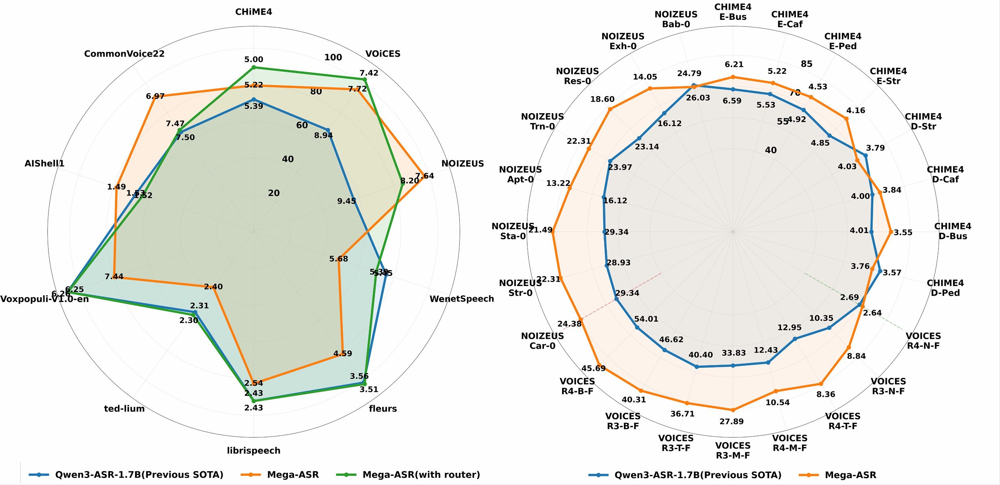

<p align="center">
  
</p>

<h1 align="center">Mega-ASR: Towards In-the-Wild^2 Speech Recognition</h1>

<p align="center">
  <b>Robust Automatic Speech Recognition for Complex Real-World Acoustic Scenarios</b>
</p>


<p align="center">
  <a href="https://xzf-thu.github.io/Mega-ASR/">
    
  </a>
  
  
  
  
</p>


<p>
We present <b>Mega-ASR</b>, an open-source speech recognition model designed for stable and robust ASR under complex dirty speech conditions, especially on medium- and high-error-rate audio.

<p>
This repository contains the official implementation, model weights, core training data, and evaluation toolkit for Mega-ASR.
</p>


<p align="center">
  <b>🚀 When conventional ASR systems fail under real-world acoustic interference, come to Mega-ASR!</b>
</p>


# ASR Model Comparison

下表对比了 6 个样本上各模型的转录结果。<span style="color:#22c55e">**绿色**</span>表示与 Ground Truth 一致的词，<span style="color:#ef4444">**红色**</span>表示错误/缺失/多余的词。每个单元格底部标注该模型在该样本上的 WER。

| Audio | Ground Truth | Mega-ASR (Ours) | Qwen3-ASR | Gemini-3-Pro | Seed-ASR | Whisper |
|---|---|---|---|---|---|---|
| <video src="assets/case_study/empty_output_recovery.mp4" controls width="240"></video> | ...and said to him let us go and eat some honey. Whose honey? inquired Kobay cautiously. My father's, Soongoora replied. Oh, all right, I'm with you, said the tortoise eagerly, and away they went.<br><br>*Reference* | <span style="color:#ef4444">He</span> said to him <span style="color:#ef4444">let's</span> go and eat some honey. <span style="color:#ef4444">It's</span> honey? inquired <span style="color:#ef4444">very</span> cautiously. My father <span style="color:#ef4444">is Superabundant</span> — oh, all right, <span style="color:#ef4444">I will</span>, said <span style="color:#ef4444">to her</span> eagerly, and away they went.<br><br>**WER: <span style="color:#22c55e">47.1</span> ✅** | <span style="color:#ef4444">&lt;empty&gt;</span><br><br>**WER: <span style="color:#ef4444">100.0</span> 🔴** | <span style="color:#ef4444">But tell me, that's how she met</span> my father<span style="color:#ef4444">'s sister</span>. Oh, all right. <span style="color:#ef4444">I wish... I really...</span><br><br>**WER: <span style="color:#ef4444">86.1</span> 🔴** | My father <span style="color:#ef4444">is</span>. Oh, all right, <span style="color:#ef4444">I wish you can</span>.<br><br>**WER: <span style="color:#ef4444">85.3</span> 🔴** | ...to him... some honey... <span style="color:#ef4444">oh yeah</span>...<br><br>**WER: <span style="color:#ef4444">92.5</span> 🔴** |
| <video src="assets/case_study/long_utterance_recovery.mp4" controls width="240"></video> | To waste, I skip forty years, said the baker in tears, and proceed without further remark to the day when you took me aboard your ship to help you in hunting the snark.<br><br>*Reference* | <span style="color:#ef4444">To witness,</span> I skip forty years, said the baker in tears, and proceed without further remark to the day when you took me aboard <span style="color:#ef4444">of</span> your ship to help you in hunting the snark.<br><br>**WER: <span style="color:#22c55e">5.9</span> ✅** | <span style="color:#ef4444">I skipped 40 years. Second day in here. Ever since you left, I've been a monk...</span><br><br>**WER: <span style="color:#ef4444">64.7</span> 🟠** | <span style="color:#ef4444">I spent forty years at sea and never seen a rougher than</span> the day <span style="color:#ef4444">that</span> you took me aboard your ship...<br><br>**WER: <span style="color:#ef4444">64.7</span> 🟠** | <span style="color:#ef4444">To wait.</span> I skip forty years. <span style="color:#ef4444">Saturday and years.</span> And proceed without further remark...<br><br>**WER: <span style="color:#ef4444">38.2</span> 🟡** | I skip forty years... to the day you took me <span style="color:#ef4444">on a ship</span>... to hunt the <span style="color:#ef4444">shark</span>.<br><br>**WER: <span style="color:#ef4444">71.5</span> 🟠** |
| <video src="assets/case_study/babble_noise_hallucination.mp4" controls width="240"></video> | The friendly gang left the drug store.<br><br>*Reference* | <span style="color:#22c55e">The friendly gang left the drug store.</span><br><br>**WER: <span style="color:#22c55e">8.0</span> ✅** | <span style="color:#ef4444">It's a</span> friendly gang. <span style="color:#ef4444">That's the drug gang.</span><br><br>**WER: <span style="color:#ef4444">57.1</span> 🟠** | <span style="color:#ef4444">Friendly</span> gang left the <span style="color:#ef4444">drugs</span>.<br><br>**WER: <span style="color:#ef4444">42.9</span> 🟡** | The friendly gang left the <span style="color:#ef4444">drugstore</span>.<br><br>**WER: <span style="color:#22c55e">28.6</span> 🟢** | <span style="color:#ef4444">A</span> friendly <span style="color:#ef4444">young man</span> left the drug store.<br><br>**WER: <span style="color:#ef4444">62.3</span> 🟠** |
| <video src="assets/case_study/restaurant_noise_recovery.mp4" controls width="240"></video> | The set of china hit the floor with a crash.<br><br>*Reference* | <span style="color:#22c55e">The set of china hit the floor with a crash.</span><br><br>**WER: <span style="color:#22c55e">8.0</span> ✅** | The <span style="color:#ef4444">bed is fine. It</span> hit the floor with a crash.<br><br>**WER: <span style="color:#ef4444">40.0</span> 🟡** | <span style="color:#ef4444">He said it's fine I</span> hit the <span style="color:#ef4444">forward slash</span>.<br><br>**WER: <span style="color:#ef4444">100.0</span> 🔴** | The <span style="color:#ef4444">sound</span> of china <span style="color:#ef4444">hits</span> the floor with a crash.<br><br>**WER: <span style="color:#22c55e">20.0</span> 🟢** | The <span style="color:#ef4444">chef</span> of <span style="color:#ef4444">China</span> hit the floor with a <span style="color:#ef4444">clash</span>.<br><br>**WER: <span style="color:#ef4444">55.0</span> 🟠** |
| <video src="assets/case_study/financial_entity_recovery.mp4" controls width="240"></video> | Among export-led electrical and computer makers, Japan Victor Company fell fifty to two thousand three hundred twenty.<br><br>*Reference* | Among export-led <span style="color:#ef4444">(missing: electrical and)</span> computer makers, Japan Victor Company fell fifty to two thousand three hundred twenty.<br><br>**WER: <span style="color:#22c55e">11.1</span> ✅** | Among export-led <span style="color:#ef4444">(missing: electrical and)</span> computer makers, Japan <span style="color:#ef4444">VictorNet sold fifty-two thousand three hundred fifty</span>.<br><br>**WER: <span style="color:#ef4444">38.9</span> 🟡** | Among export-led <span style="color:#ef4444">(missing: electrical and)</span> computer makers, Japan Victor <span style="color:#ef4444">Co.</span> fell <span style="color:#ef4444">50</span> to <span style="color:#ef4444">2,350 yen</span>.<br><br>**WER: <span style="color:#ef4444">35.7</span> 🟡** | Among export-led <span style="color:#ef4444">in</span> computer makers, Japan Victor Company <span style="color:#ef4444">sell 50 to 2300 unit</span>.<br><br>**WER: <span style="color:#ef4444">50.0</span> 🟠** | Among <span style="color:#ef4444">exporters,</span> computer makers <span style="color:#ef4444">in Japan victor companies sold</span> fifty...<br><br>**WER: <span style="color:#ef4444">66.7</span> 🟠** |
| <video src="assets/case_study/phrase_recovery.mp4" controls width="240"></video> | Has exposure really been reduced?<br><br>*Reference* | <span style="color:#22c55e">Has exposure really been reduced</span><span style="color:#ef4444">.</span><br><br>**WER: <span style="color:#22c55e">8.0</span> ✅** | Has exposure really <span style="color:#ef4444">done you?</span><br><br>**WER: <span style="color:#ef4444">40.0</span> 🟡** | Has <span style="color:#ef4444">the closure</span> really <span style="color:#ef4444">affected you?</span><br><br>**WER: <span style="color:#ef4444">80.0</span> 🔴** | Has exposure <span style="color:#ef4444">to beauty products.</span><br><br>**WER: <span style="color:#ef4444">60.0</span> 🟠** | <span style="color:#ef4444">Have those who</span> really <span style="color:#ef4444">been refused?</span><br><br>**WER: <span style="color:#ef4444">78.5</span> 🔴** |

## 🔥🔥🔥 News!!

- **May 20, 2025**: 🔥 We release **Mega-ASR**. Model weights on Hugging Face are coming soon.
- **May 20, 2025**: 🔥 We release **Voices-in-the-Wild-2M**, a benchmark for in-the-wild ASR robustness evaluation. [[Dataset]](https://huggingface.co/datasets/zhifeixie/Voices-in-the-Wild-test-v2)
- **Coming soon**: 🔥 We will release the **DAPO-LoRA training code**.

## Contents

- [Introduction](#introduction)
- [Model Download](#model-download)
- [Main Results](#main-results)
- [Project Structure](#project-structure)
- [Quick Start](#quick-start)
- [Inference](#inference)
- [Finetune](#finetune)
- [Evaluation](#evaluation)


## Introduction


Mega-ASR is designed for speech recognition in complex real-world acoustic environments, where speech signals are often affected by noise, reverberation, far-field recording, low volume, distortion, stuttering, echo, obstruction, and multiple overlapping interferences. Unlike general-purpose ASR systems that mainly perform well on clean or moderately noisy speech, Mega-ASR focuses on medium- and high-error-rate audio conditions, where recognition stability becomes more challenging.

To improve robustness, Mega-ASR is built with large-scale dirty speech data and a two-stage robustness training pipeline. The released resources include model weights, core training data, evaluation benchmarks, and WER/CER evaluation scripts, enabling reproducible research and further development of robust ASR systems for in-the-wild scenarios.

- **Robust dirty and general ASR**: supports stable recognition for both in-the-wild dirty speech and general audio.
- **2M-scale dirty speech corpus**: covers noise, far-field recording, distortion, stuttering, echo, obstruction, and mixed acoustic interference.
- **SFT + RL robustness training**: improves recognition stability under complex acoustic conditions through supervised fine-tuning and reinforcement learning.
- **Reproducible WER/CER evaluation**: provides standard scripts and benchmarks for ASR robustness evaluation.
- **DAPO-LoRA roadmap**: reinforcement learning training code will be released in a future update.


## Model Download

We provide two Mega-ASR model variants for different usage scenarios.

| Model | Description | Download |
|---|---|---|
| **Mega-ASR for Dirty** | Optimized for dirty speech scenarios, including noisy, far-field, low-volume, degraded, and hard-to-recognize audio. | Coming soon |
| **Mega-ASR for All** | Built upon Mega-ASR for Dirty with a lightweight routing module that automatically distinguishes clean speech from degraded speech and selects the appropriate recognition path. | Coming soon |

After downloading the model weights, please specify the model path in the corresponding inference script or pass it through command-line arguments.


## Project Structure


<p align="center">
  
</p>

<p align="center">
  <b>Figure 1.</b> Overview of the Mega-ASR training pipeline, including acoustic-to-speech supervised fine-tuning and reward-based optimization for robust speech recognition.
</p>

```text
Mega-ASR/
├─ assets/
│  └─ Figures, logos, and other README resources.
│
├─ configs/
│  └─ Configuration files for SFT-LoRA and DAPO-LoRA training.
│
├─ data/
│  └─ Local data directory. Large-scale audio data is not tracked by Git.
│
├─ eval/
│  └─ evaluate_wer.py
│     WER/CER evaluation utilities for ASR robustness testing.
│
└─ src_MegaASR/
   ├─ inference/
   │  ├─ inference_MegaASR_for_dirty.py
   │  │  Dirty-speech inference without routing, designed for degraded audio.
   │  │
   │  └─ inference_MegaASR_for_all.py
   │     General inference with routing, supporting both dirty and general audio.
   │
   └─ train/
      ├─ SFT_lora/
      │  └─ SFT_lora.py
      │     SFT-LoRA training pipeline for acoustic robustness adaptation.
      │
      └─ DAPO_lora/
         └─ DAPO-LoRA training module, to be released in a future update.
```

## Main Results

Mega-ASR is evaluated across three benchmark families, including noisy and robust ASR benchmarks, Voices-in-the-Wild-Bench, and standard ASR benchmarks. Lower WER/CER indicates better recognition performance.

<p align="center">
  
</p>

<p align="center">
  <b>Figure 2.</b> Radar comparison of Qwen3-ASR-1.7B and Mega-ASR across selected ASR evaluation subsets.
</p>

### Noisy and Robust ASR Benchmarks

<p align="center">
  
</p>

<p align="center">
  <b>Table 1.</b> Performance comparison on noisy and robust ASR benchmarks.
</p>

### Voices-in-the-Wild-Bench

<p align="center">
  
</p>

<p align="center">
  <b>Table 2.</b> Breakdown results on Voices-in-the-Wild-Bench by acoustic scenario.
</p>

### Standard ASR Benchmarks

<p align="center">
  
</p>

<p align="center">
  <b>Table 3.</b> Performance comparison on standard ASR benchmarks. For LibriSpeech, each entry is reported as clean/other.
</p>

## Quick Start

### 1. Create Environment

We recommend using Conda to create an isolated Python environment.

```bash
conda create -n mega-asr2 python=3.12 -y
conda activate mega-asr2
```

Upgrade basic Python build tools:

```bash
python -m pip install --upgrade pip setuptools wheel
```

### 2. Install PyTorch

Install PyTorch with CUDA 12.8 support:

```bash
pip install  torch==2.10.0   torchaudio==2.10.0   torchvision==0.25.0
```

### 3. Install Mega-ASR Dependencies

```bash
pip install -r mega_asr_requirements.txt
```

### 4. Install Qwen3-ASR Dependency

Mega-ASR is built upon Qwen3-ASR. Please prepare the Qwen3-ASR source code locally and install it in editable mode:

```bash
pip install -e /path/to/Qwen3-ASR --no-deps
```

For example, replace `/path/to/Qwen3-ASR` with the actual local path of your Qwen3-ASR repository.

## Inference

Mega-ASR provides two inference modes for different usage scenarios.


### 1. Inference for Dirty Audio

This mode is designed for degraded or hard-to-recognize speech, such as noisy, far-field, distorted, or mixed-interference audio.


```bash
bash scripts/inference_MegaASR_for_dirty.sh
```

### 2. Inference for General Audio

This mode supports both dirty speech and general audio. It uses a routing mechanism to select the appropriate recognition path automatically.

### 3. Web-based Inference

We also provide Gradio-based web inference scripts for interactive testing.

For dirty-audio inference:

```bash
bash scripts/web_inference_MegaASR_for_dirty.sh
```

For general audio inference with automatic routing:

```bash
bash scripts/web_inference_MegaASR_for_all.sh
```


## Evaluation

We provide `evaluate_wer.py` to run Qwen3-ASR inference and compute WER/CER on JSONL-formatted evaluation data.

```bash
CUDA_VISIBLE_DEVICES=6,7 python evaluate_wer.py \
  --input_jsonl example/examples.jsonl \
  --output_jsonl output_with_wer.jsonl
```

The script loads Qwen3-ASR, transcribes each audio file, writes the generated transcription to the `prediction` field, and computes the error rate against the reference transcription.

- English samples are evaluated with **WER**.
- Chinese samples are evaluated with **CER**.
- The output JSONL keeps the original fields and adds prediction and error-rate information.
- The input JSONL does **not** need to contain a `prediction` field. The `prediction` field is generated by `evaluate_wer.py`.
- Please make sure that `evaluate_wer.py` and `cn_tn.py` are placed in the same directory. The `cn_tn.py` module is used for Chinese text normalization before CER computation.

### Input Format

Each line in the input file should be a JSON object. An example is shown below:

```json
{
  "index": 1755,
  "audio_path": "examples/noise.wav",
  "question": "Please transcribe the audio content into text.",
  "answer": "I usually take the quieter road home because the main street gets crowded after work.",
}
```

Required fields are:

| Field | Description |
|---|---|
| `audio_path` | Path to the input audio file. |
| `answer` | Ground-truth transcription. |

Optional fields such as `index`will be kept unchanged in the output JSONL.

If the audio path is relative, it should be relative to the current working directory or to the JSONL file location, depending on how the script is executed.

### Output Format

The output file is also a JSONL file. It preserves the original fields and adds Qwen3-ASR prediction and error-rate information.

Example output:

```json
{
  "index": 1755,
  "audio_path": "examples/noise.wav",
  "question": "Please transcribe the audio content into text.",
  "answer": "I usually take the quieter road home because the main street gets crowded after work.",
  "prediction": "I usually take the quieter road home because the main street gets crowded after work.",
  "pred_language": "English",
  "wer": 0.0,
  "metric": "wer",
  "num_edits": 0,
  "ref_len": 15
}
```

For Chinese samples, `metric` will be set to `"cer"`. For compatibility with the evaluation pipeline, the error-rate value is still stored in the `wer` field, but it represents CER when `metric` is `"cer"`.

### WER / CER Computation

For English samples, the script computes Word Error Rate (WER):

```text
WER = (S + D + I) / N
```

where:

- `S` is the number of substitutions.
- `D` is the number of deletions.
- `I` is the number of insertions.
- `N` is the number of words in the reference transcription.

For Chinese samples, the script computes Character Error Rate (CER):

```text
CER = (S + D + I) / N
```

where `N` is the number of characters in the reference transcription.

Before computing WER/CER, the script performs text normalization. English text is normalized before word-level comparison. Chinese text is normalized with `cn_tn.py` before character-level comparison.

### File Placement

Please place `evaluate_wer.py` and `cn_tn.py` in the same directory:

```text
eval/
├── evaluate_wer.py
├── cn_tn.py
└── example/
    └── examples.jsonl
```

Then run the evaluation command from the same directory:

```bash
cd eval

CUDA_VISIBLE_DEVICES=6,7 python evaluate_wer.py \
  --input_jsonl example/examples.jsonl \
  --output_jsonl output_with_wer.jsonl
```


## Dirty Speech Data Generation

The data generation code for our Voices-in-the-Wild training data is provided under:

```text
dataset/dataloader/
```

The core scheduling entry is:

```text
dataset/dataloader/scheduler.py
```

This module is responsible for organizing the data generation workflow and scheduling different data construction components.

Please note that the detailed implementations of individual perturbation functions, as well as the exact parameter settings used for single or mixed acoustic corruptions, are not included in this public release. These components are currently closed-source. The released dataloader code mainly provides the overall data scheduling interface and the public structure used in our training pipeline.


## Finetune

Mega-ASR supports acoustic robustness adaptation through both supervised fine-tuning and reinforcement learning based optimization.


### 1. A2S-SFT

SFT-LoRA is used to adapt Mega-ASR to complex dirty speech scenarios with supervised training data.

```bash
bash A2S-SFT_stage1.sh
bash A2S-SFT_stage2.sh
bash A2S-SFT_stage3.sh
```


#### Hyperparameter Configuration

The following training hyperparameters are exposed as placeholders in the public script. Users should set them according to their own dataset scale, GPU memory, LoRA configuration, and training objective.

```bash
--batch_size <BATCH_SIZE> \
--grad_acc <GRAD_ACC> \
--lr <LR> \
--lr_tower <LR_TOWER> \
--lr_proj <LR_PROJ> \
--lr_llm <LR_LLM> \
--epochs <EPOCHS> \
--save_steps <SAVE_STEPS> \
--save_total_limit <SAVE_TOTAL_LIMIT> \
--use_lora <USE_LORA> \
--lora_scope <LORA_SCOPE> \
--lora_r <LORA_R> \
--lora_alpha <LORA_ALPHA> \
--lora_dropout <LORA_DROPOUT> \
--warmup_ratio <WARMUP_RATIO> \
--max_grad_norm <MAX_GRAD_NORM> \
--weight_decay <WEIGHT_DECAY>
```

Here, `<LR_TOWER>`, `<LR_PROJ>`, and `<LR_LLM>` correspond to the learning rates of different LoRA parameter groups. We do not provide fixed default values for these hyperparameters, since they are sensitive to the training data, corruption distribution, batch size, and target LoRA scope.

Please record the final hyperparameter values used in your own experiments for reproducibility.


#### Training Data Format

The SFT training data should be provided in JSONL format. Each line corresponds to one audio-text training sample.

The expected format is:

```json
{
  "audio": ".../wavs/test-clean/61/70968/61-70968-0000.wav",
  "text": "language English<asr_text>THE TRANSCRIPT TEXT",
  "prompt": ""
}
```

Field descriptions:

| Field | Description |
|---|---|
| `audio` | Path to the input audio file. |
| `text` | Target transcription. The transcription should follow the format `language <LANGUAGE><asr_text><TRANSCRIPTION>`. |
| `prompt` | Optional prompt field. It can be left empty for standard ASR training. |

For English ASR data, the `text` field should typically be written as:

```text
language English<asr_text>THE TRANSCRIPT TEXT
```

For Chinese ASR data, the language tag can be changed accordingly, for example:

```text
language Chinese<asr_text>转写文本
```

#### LibriSpeech Format Conversion

We provide a script to convert the default LibriSpeech JSONL metadata into the Mega-ASR SFT training format.

The conversion script is located at:

```text
dataset/data_format/convert_libri_to_sft_format.sh
```

Example usage:

```bash
bash dataset/data_format/convert_libri_to_sft_format.sh
```

The converted output JSONL follows the training format required by Mega-ASR:

```json
{
  "audio": ".../wavs/test-clean/61/70968/61-70968-0000.wav",
  "text": "language English<asr_text>THE TRANSCRIPT TEXT",
  "prompt": ""
}
```

This script is mainly intended for converting LibriSpeech-style metadata into the unified Mega-ASR SFT format. It can also be used as a reference for preparing custom ASR training data.


### 2. DG-WGPO

DG-WGPO is designed for reinforcement learning based robustness optimization after supervised fine-tuning.


The DG-WGPO training module is under active research and will be released in a future update.


## Citation

If you find this project useful, please consider citing our work. Citation information will be updated after the release of the paper.

## License

This project will be released under the Apache-2.0 License.

123